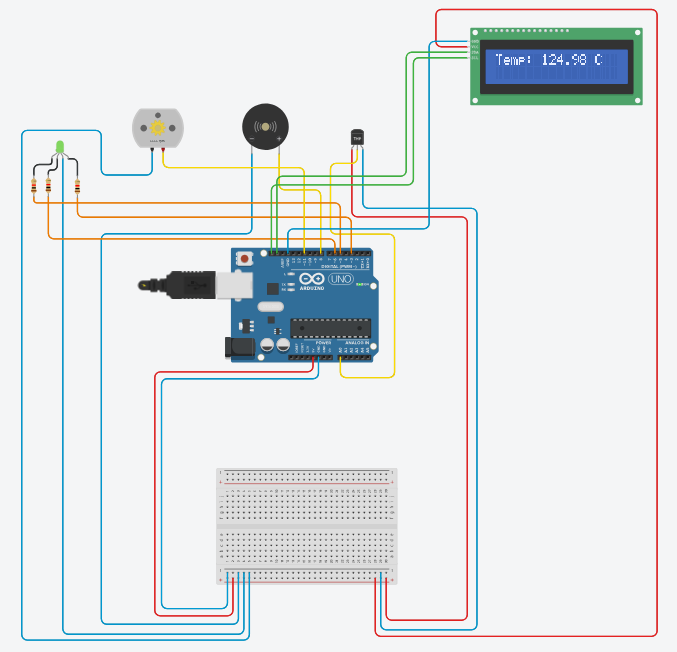
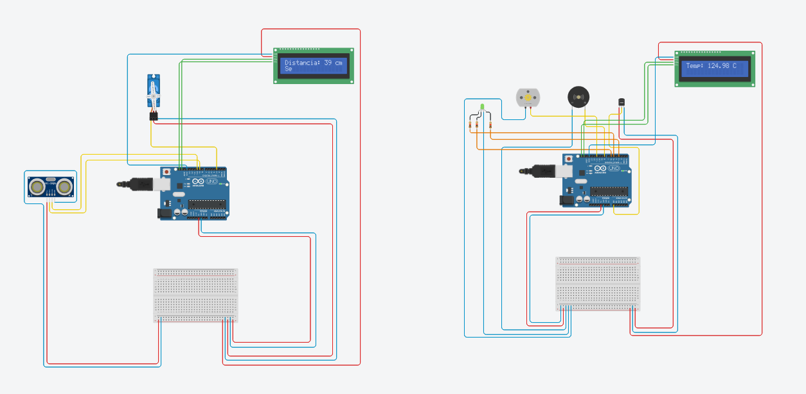

# Circuito com Sensor Ultrassônico, Servo Motor, Sensor de Temperatura e LED RGB


## Descrição Geral

Este projeto implementa dois circuitos distintos integrados em um único Arduino, utilizando sensores e atuadores para interagir com o ambiente. Ele é composto por dois sistemas principais:

### Sistema de Detecção de Proximidade com Sensor Ultrassônico e Servo Motor:
- Quando o sensor ultrassônico detecta um objeto a uma distância muito próxima (definida como menos de 10 cm no código), o motor servo é acionado, movendo-se para uma posição específica (90 graus).



### Sistema de Monitoramento de Temperatura com Ações Multimodais:
- Ao detectar uma temperatura elevada (definida como acima de 30 °C no código), são realizadas as seguintes ações:
  - O motor DC é acionado.
  - Um buzzer (piezo) emite um sinal sonoro.
  - O LED RGB acende em uma cor específica (verde) para indicar a condição de alerta.



## Objetivos

O projeto foi desenvolvido com os seguintes objetivos:

- Aprender a integrar múltiplos sensores e atuadores.
- Trabalhar com medições de distância e temperatura para realizar ações específicas.
- Utilizar diferentes tipos de atuadores (servo motor, motor DC, buzzer e LED RGB) para fornecer feedback físico e visual.
- Consolidar conhecimentos sobre eletrônica e programação no ambiente Arduino.


## Componentes Utilizados

## 1. Hardware

- **Sensor Ultrassônico (HC-SR04)**:
  - Mede a distância até um objeto com precisão.
  
- **Sensor de Temperatura (TMP36)**:
  - Converte a temperatura ambiente em uma saída de tensão proporcional.

- **Servo Motor**:
  - Realiza movimentos de rotação controlados em graus (0-180°).

- **Motor DC**:
  - Gira continuamente para simular uma resposta física ao aumento de temperatura.

- **Piezo (Buzzer)**:
  - Emite sinais sonoros para alertas.

- **LED RGB**:
  - Exibe diferentes cores com base na situação (vermelho para altas temperaturas).

- **Arduino Uno R3**:
  - Microcontrolador que gerencia os sensores e atuadores.

- **Breadboard e Jumpers**:
  - Facilitam a conexão dos componentes.

- **Resistores (1 kΩ)**:
  - Limitam a corrente para o LED RGB, protegendo seus circuitos.
 
## Funcionamento Detalhado

### Sistema de Proximidade (Sensor Ultrassônico + Servo Motor):
- O sensor ultrassônico mede a distância até o objeto.
- Se a distância detectada for menor que 10 cm (configurável), o motor servo se move para 90 graus.
- Caso contrário, o motor servo retorna à posição inicial (0 graus).

### Sistema de Temperatura (TMP36 + Buzzer + Motor DC + LED RGB):
- O TMP36 mede a temperatura ambiente e converte a leitura para graus Celsius.
- Se a temperatura ultrapassar 30 °C (configurável):
  - O motor DC é ativado.
  - O buzzer emite um som com frequência de 1000 Hz.
  - O LED RGB acende na cor verde.
- Se a temperatura for normal, os atuadores permanecem desativados.

## Programação em C++

### Código

```cpp
#include <Servo.h>

#define TRIG_PIN 9
#define ECHO_PIN 10
#define SERVO_PIN 3

#define TEMP_SENSOR A0
#define BUZZER_PIN 8
#define MOTOR_PIN 11  
#define RED_PIN 5
#define GREEN_PIN 6
#define BLUE_PIN 7

Servo servoMotor;

float readTemperature() {
  int analogValue = analogRead(TEMP_SENSOR);
  float voltage = analogValue * (5.0 / 1023.0);
  float temperatureC = (voltage - 0.5) * 100.0;
  return temperatureC;
}

void setup() {
  pinMode(TRIG_PIN, OUTPUT);
  pinMode(ECHO_PIN, INPUT);
  servoMotor.attach(SERVO_PIN);
  servoMotor.write(0);

  pinMode(BUZZER_PIN, OUTPUT);
  pinMode(MOTOR_PIN, OUTPUT);
  pinMode(RED_PIN, OUTPUT);
  pinMode(GREEN_PIN, OUTPUT);
  pinMode(BLUE_PIN, OUTPUT);

  Serial.begin(9600);
}

void loop() {
  long duration, distance;

  digitalWrite(TRIG_PIN, LOW);
  delayMicroseconds(2);
  digitalWrite(TRIG_PIN, HIGH);
  delayMicroseconds(10);
  digitalWrite(TRIG_PIN, LOW);

  duration = pulseIn(ECHO_PIN, HIGH);

  distance = duration * 0.034 / 2;

  Serial.print("Distância: ");
  Serial.print(distance);
  Serial.println(" cm");

  if (distance < 10) {
    servoMotor.write(90); 
  } else {
    servoMotor.write(0); 
  }

  float temperature = readTemperature();
  Serial.print("Temperatura: ");
  Serial.print(temperature);
  Serial.println(" °C");

  if (temperature > 30.0) { 
    digitalWrite(MOTOR_PIN, HIGH);

    tone(BUZZER_PIN, 1000, 500); 

    analogWrite(RED_PIN, 255);
    analogWrite(GREEN_PIN, 0);
    analogWrite(BLUE_PIN, 0);
  } else {
    digitalWrite(MOTOR_PIN, LOW);

    analogWrite(RED_PIN, 0);
    analogWrite(GREEN_PIN, 0);
    analogWrite(BLUE_PIN, 0);
  }

  delay(100); 
}
```


## Créditos

Desenvolvido por Mateus S.  
GitHub: [Matz-Turing](https://github.com/Matz-Turing)
